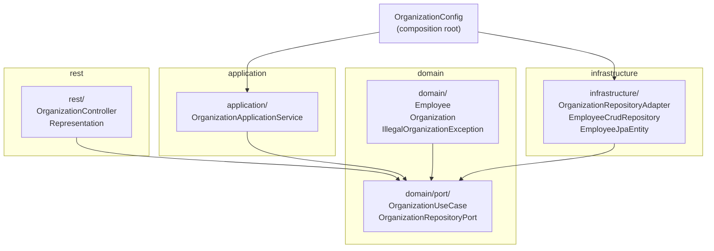

# Organization Hierarchy API

A Spring Boot + Kotlin REST API for managing organizational hierarchies, built as a coding exercise to practice hexagonal architecture, domain modeling, and testing strategy in Kotlin.

## What it does

The API manages a single organization tree where each employee has at most one manager. Three endpoints cover the core use cases:

- `POST /organization` — load or update the hierarchy by passing a map of `"employee": "manager"` pairs
- `GET /organization` — return the full hierarchy as a nested JSON tree from root to leaves
- `GET /organization/employee/{name}/management` — return the upstream chain from a named employee to the root

The domain enforces two invariants: exactly one employee may have no manager (single root), and no manager chain may form a cycle. Both violations return HTTP 400.

## Architecture

The project follows **hexagonal (ports and adapters)** architecture. The dependency rule is strict: domain code imports nothing from Spring, JPA, or any HTTP library. Infrastructure and REST depend on the domain; the domain depends on nothing outside itself.



The practical consequence is that the domain — `Employee`, `Organization`, `IllegalOrganizationException` — can be instantiated and tested with no application context at all. `OrganizationTest.kt` does exactly that.

### Domain

`Organization` is the aggregate root. It holds a private mutable map of employees indexed by name, exposes a read-only view, and routes all mutations through `addEmployees()`. That method resolves references between names, runs cycle detection via a `tailrec` function that walks the manager chain upward, and checks that the resulting state has exactly one root.

`Employee` is a plain class (not a data class) with mutable `manager` and `managed` fields. Equality is name-based, which matters for set membership during hierarchy reconstruction.

### Infrastructure

`OrganizationRepositoryAdapter` translates between JPA entities and domain objects. On load, it makes two passes: first builds a `Map<String, Employee>` from all rows, then wires the manager/managed relationships. On save, it fetches all existing entities upfront and calls `saveAll()` once — avoiding N+1 queries. The JPA `@ManyToOne` cascade is `PERSIST, MERGE` only; removing an employee cannot accidentally delete a manager.

### REST

`Representation.kt` holds two standalone functions — `topDown()` and `upstreamHierarchy()` — that recursively serialize domain `Employee` objects to `Map<String, Any>`. They are pure functions with no side effects and no Spring dependency.

`OrganizationConfig` is the composition root: it wires the application service with the repository port, keeping Spring DI out of the domain classes themselves.

## Running

Requires Java 25 and uses an H2 in-memory database that is wiped on each restart.

```bash
./mvnw spring-boot:run        # Start the server
./mvnw test                   # Run all tests
./mvnw test -Dtest=OrganizationTest  # Run one test class
```

### Example

```bash
# Load a hierarchy
curl -X POST http://localhost:8080/organization \
  -H "Content-Type: application/json" \
  -d '{"Alice": "", "Bob": "Alice", "Carol": "Alice", "Dave": "Bob"}'

# Fetch top-down view
curl http://localhost:8080/organization

# Fetch management chain for Dave
curl http://localhost:8080/organization/employee/Dave/management
```

`"Alice": ""` (empty string) marks Alice as the root. Any employee mapped to an empty string has no manager.

## Testing strategy

Each layer has its own test approach, chosen to keep tests fast and to test the right thing at the right level.

| Test class | What it tests | How |
|---|---|---|
| `EmployeeTest` | Domain entity methods | Plain instantiation |
| `OrganizationTest` | Business rules (cycles, root invariant) | Mocked `EmployeeRepositoryPort` |
| `RepresentationKtTest` | JSON serialization functions | Plain instantiation |
| `OrganizationControllerTest` | HTTP response shapes | Mocked `OrganizationUseCase` |
| `EmployeeCrudRepositoryTests` | Spring Data repository queries | `@SpringBootTest` + H2 |
| `OrganizationRepositoryAdapterTest` | Load/save mapping logic | Mocked `EmployeeCrudRepository` |
| `IntegrationTests` | Full HTTP round-trips | `@SpringBootTest(webEnvironment=RANDOM_PORT)` |

Integration tests cover the error paths explicitly: cyclic dependency, multiple roots, and unknown employee each get a separate test verifying the 400 response body.

## Exercise goals

The exercise starts from a working but naive implementation and asks you to introduce hexagonal architecture, fix a set of bugs (broken test assertions, N+1 queries, cascade misconfiguration), add Kotlin idioms (`tailrec`, named returns, scope functions), and build out a test suite that covers round-trips and all error paths.

The git history traces that progression: dependency inversion and layer separation came first, then JPA and cascade fixes, then idiomatic Kotlin cleanup, and finally test coverage.

## Tech stack

- Java 25, Kotlin 2.3.21, Spring Boot 4.0.6
- Spring Data JPA with H2 in-memory database
- Jackson Kotlin module for JSON
- JUnit 5, AssertJ, Mockito-Kotlin 5.4.0
